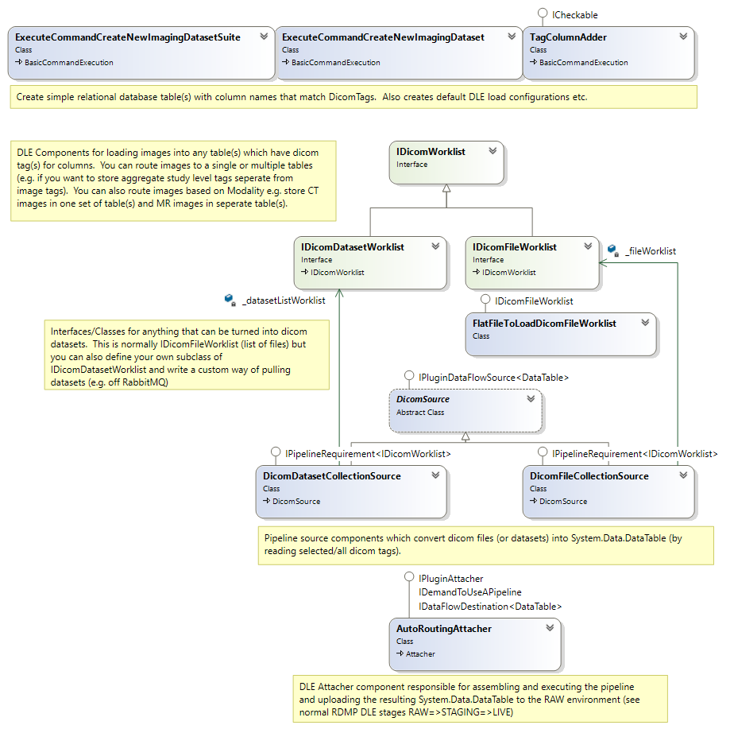

# Data Load
## Background
Data loading in RDMP involves loading a RAW environment (empty copy of the live database schema) with data.  The components responsible for data load are called `Attachers` and typically produce a `System.Data.DataTable` based on their role and user configuration (e.g. reading a CSV file, Excel file, records from a remote database etc).

All tables loaded by RDMP must have a Primary Key (which comes from the source data i.e. not an autonum).  Identical duplication is automatically handled when migrating from RAW to STAGING (prior to MERGE with LIVE).

## Implementation

'Image tables' are any table which contains one or more columns which are named after Dicom tags (e.g. PatientID).  In addition you can include a column (See constant `DicomTypeTranslation.TableCreation.ImagingTableCreation.RelativeFileArchiveURI`) which contains the path (relative or absolute) to the dicom image (which can be stored in a zip archive if desired).  Typically the primary key on these tables should be a UID e.g. SOPInstanceUID.

You can create/edit an imaging table using the schema commands e.g.  `ExecuteCommandCreateNewImagingDataset`

The `AutoRoutingAttacher` class is responsible for turning dicom datasets into `System.Data.DataTable` after which they are treated just like regular attached data.

_AutoRoutingAttacher Components_

## Study/Series/Image Level

Tags in dicom files are replicated in each file (frame) in a series.  Some tags vary with every image e.g. SOPInstanceUID, SliceLocation etc.  Other tags are always the same within a study e.g. PatientID.  You may want to store such tags in different tables (creating 1 study record for all images in the study).  This can be done simply by choosing the columns and primary key correctly e.g. create a table with a primary key of StudyInstanceUID and including only study level tags.  Since the RDMP DLE handles exact duplication only a single record will be created during the load (assuming all images are in the same study).

Sometimes there are differences in study/series level tags between images when you would not expect it, the following components assist with resolving this duplication during the DLE:

|Component | Description
|-------|----|
|Coalescer|  Core RDMP component which handles resolving when a tag (field) is missing in one record but present in another (for a given primary key)|
|SafePrimaryKeyCollisionResolverMutilation | Core RDMP component which handles resolving primary key collisions based on a single (non primary key) column e.g. StudyDate.  You can prefer the larger / smaller value etc |
|[PrimaryKeyCollisionIsolationMutilation](./../Rdmp.Dicom/PipelineComponents/PrimaryKeyCollisionIsolationMutilation.md) | If all the above components failed then you can use this one to isolate the colliding records into a store (and drop them from the data load) |